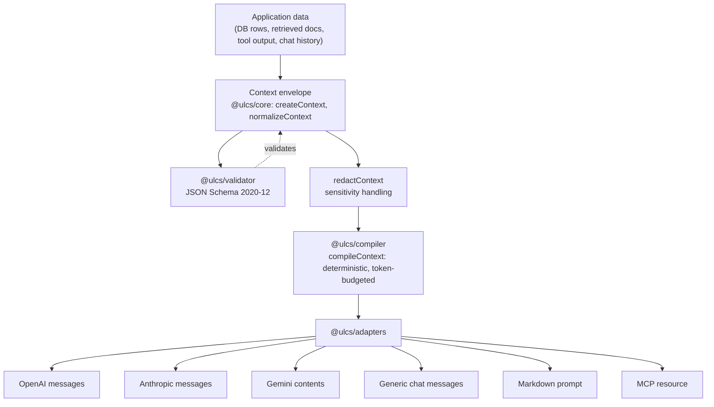

# Open Context Specification (OCS)

[](https://github.com/Nitish1612/open-context-spec/actions/workflows/ci.yml)
[](./LICENSE)


> [!IMPORTANT]
> Open Context Specification is an experimental community draft. It is not
> currently an established industry standard, and breaking schema changes may
> occur before version 1.0. See [Maturity status](#maturity-status) below.

**Open Context Specification (OCS)** is an open, vendor-neutral
specification for representing the context you give to a Large Language
Model — facts, instructions, conversation history, retrieved documents,
tool output, memory, preferences — as structured, validated,
provenance-tracked data, independent of any single model provider's
message format or any single agent framework.

## A note on naming

This project was drafted under the working name **Universal LLM Context
Schema (ULCS)**, and that name is still embedded throughout the source
code: the npm package scope (`@ulcs/*`), the `ulcs` CLI binary, the
`urn:ulcs:*` identifier scheme, and the `https://ulcs.dev/...` schema/JSON-LD
namespace. These are **provisional compatibility identifiers**, kept
unchanged deliberately — renaming a schema `$id` or a published npm scope
is not a cosmetic edit, it changes what the identifier _is_. The full
rename plan, including timing and backward-compatibility guarantees, is
recorded in
[ADR-0004](./specification/decisions/0004-ocs-branding-and-ulcs-migration.md).
Until that migration lands, code samples in this README correctly show
`@ulcs/*` imports and the `ulcs` command — that is not a typo.

```bash
# package names and CLI binary are still `ulcs`-prefixed — see the naming note above
node packages/cli/dist/bin.js validate my-context.json
node packages/cli/dist/bin.js compile my-context.json --target openai
```

## The problem

Every LLM application eventually builds the same untyped pile: a system
prompt string, some retrieved text, a JSON blob of "facts," a conversation
array, maybe a memory store — all flattened into one string or one
provider's message array right before the API call. That flattening throws
away information that matters:

- **Facts and instructions become indistinguishable.** A retrieved web page
  and a developer's system prompt end up as adjacent, equally-weighted text.
- **Trust is implicit, if tracked at all.** Nothing stops a scraped page's
  content from reading like an authoritative instruction.
- **Sensitivity labels don't survive the trip** from database to prompt.
- **Token-budget truncation is ad hoc and non-deterministic**, so the same
  input can produce a different compiled prompt on every run.
- **Every provider integration reinvents this pipeline from scratch**, with
  no shared vocabulary between an OpenAI integration, an Anthropic
  integration, and a RAG pipeline in the same codebase.

OCS is a schema, a vocabulary, and a small deterministic toolchain for the
step _before_ any of that flattening happens — applicable to direct
provider integrations, agent frameworks, RAG pipelines, and MCP
applications alike.

## Why this is not just another prompt template

A prompt template fills placeholders in a string. OCS is a **data model**:
it defines what a fact _is_, what an instruction's authority _is_, what
"untrusted" _means_, and how to compile a validated document under a token
budget into six different provider shapes — deterministically, with every
lossy decision documented. You can build a prompt template on top of a
compiled OCS context; you cannot recover OCS's structure (trust, authority,
provenance, sensitivity, token accounting) from a template.

Concretely, OCS gives you things a template cannot:

- A JSON Schema you can validate against in CI.
- A hard guarantee that untrusted content can never become an authoritative
  instruction (schema-enforced, not just documented).
- A merge algorithm that never silently overwrites a disputed fact.
- A deterministic compiler with a documented, testable token-budget
  algorithm — not "whatever `.slice()` calls happened to survive review."

## How OCS differs from adjacent standards

|                                                                | What it does                                                                                  | Relationship to OCS                                                                                                                                                                   |
| -------------------------------------------------------------- | --------------------------------------------------------------------------------------------- | ------------------------------------------------------------------------------------------------------------------------------------------------------------------------------------- |
| **Schema.org**                                                 | Shared vocabulary for web entities (Person, Product...), for search engines.                  | Same "shared vocabulary via JSON-LD" pattern, applied to LLM context instead of web pages. No concept of instruction authority or trust.                                              |
| **JSON Schema (2020-12)**                                      | Validates JSON structure.                                                                     | OCS _uses_ it — `schemas/v1/*.schema.json` are the normative validation layer. It doesn't define what a "fact" means; OCS's vocabulary docs do.                                       |
| **JSON-LD**                                                    | Gives JSON documents linkable semantics via `@context`/`@type`.                               | OCS's canonical form (`schemas/context/v1.jsonld`); plain JSON without JSON-LD processing is equally valid OCS.                                                                       |
| **MCP (Model Context Protocol)**                               | Transports context, resources, and tool calls between an AI application and external systems. | OCS defines _what the content means_; MCP defines _how it moves_. A context document can be the `text` of an MCP resource. They compose — see `specification/v1/interoperability.md`. |
| **RAG frameworks**                                             | Retrieval pipelines that fetch and rank documents.                                            | OCS gives a retriever's output a standard shape (`Resource`/`Fact` + `Citation` + `trust.level: "untrusted"`) so different retrievers interoperate.                                   |
| **Provider message APIs** (OpenAI/Anthropic/Gemini `messages`) | The wire format one specific API accepts.                                                     | OCS compiles _into_ these — see the adapters package — and depends on none of their SDKs.                                                                                             |

## Quick start (5 minutes)

```bash
git clone https://github.com/Nitish1612/open-context-spec.git ocs
cd ocs
pnpm install
pnpm run build

# Validate a document against the schema
node packages/cli/dist/bin.js validate examples/minimal/context.json

# Compile it under its token policy and render it for a provider
node packages/cli/dist/bin.js compile examples/minimal/context.json --target openai
```

Or use the SDK directly:

```typescript
import { createContext, normalizeContext } from "@ulcs/core";
import { validateContext } from "@ulcs/validator";
import { compileContext } from "@ulcs/compiler";
import { toOpenAIMessages, toAnthropicMessages, toGeminiContents } from "@ulcs/adapters";

// 1. Build your context (facts, instructions, retrieved docs, etc.)
const ctx = createContext({
  instructions: [
    {
      id: "urn:ulcs:instr:1",
      "@type": "Instruction",
      authority: "system",
      content: "Answer using only the facts provided.",
      trust: { level: "trusted", providesInstructions: true },
    },
  ],
  facts: [{ id: "urn:ulcs:fact:1", "@type": "Fact", content: "The customer is on the Pro plan." }],
});

// 2. Normalize + validate
const normalized = normalizeContext(ctx);
const result = validateContext(normalized);
if (!result.valid) throw new Error(JSON.stringify(result.errors));

// 3. Compile under a token budget
const compiled = compileContext(normalized, { tokenPolicyOverrides: { maxContextTokens: 4000 } });

// 4a. Render for OpenAI and pass into the official SDK yourself
const { messages } = toOpenAIMessages(compiled);
// await openai.chat.completions.create({ model: "gpt-4o", messages });

// 4b. ...or Anthropic
const { system, messages: turns } = toAnthropicMessages(compiled);
// await anthropic.messages.create({ model: "claude-...", system, messages: turns });

// 4c. ...or Gemini
const { systemInstruction, contents } = toGeminiContents(compiled);
// await model.generateContent({ systemInstruction, contents });
```

## Minimal example

```json
{
  "@context": "https://ulcs.dev/context/v1",
  "@type": "ContextEnvelope",
  "schemaVersion": "1.0.0",
  "id": "urn:ulcs:context:minimal-qa",
  "createdAt": "2026-08-15T12:00:00Z",
  "instructions": [
    {
      "id": "urn:ulcs:instr:system-1",
      "@type": "Instruction",
      "authority": "system",
      "content": "Answer only using the facts provided in this context.",
      "trust": { "level": "trusted", "providesInstructions": true }
    }
  ],
  "facts": [
    {
      "id": "urn:ulcs:fact:1",
      "@type": "Fact",
      "content": "OCS is a draft, vendor-neutral context standard for LLMs."
    }
  ]
}
```

The `@context` IRI, `urn:ulcs:*` ids, and `schemas/v1` `$id`s are the
provisional compatibility identifiers described above — the document is a
valid OCS document regardless.

See [`examples/`](./examples) for ten more, covering RAG with a live
prompt-injection sample, agent tool results, long-term memory, conflicting
facts, expired information, sensitivity-based redaction, token-budget
compilation, and every provider adapter's output side by side.

## Architecture

```text
Application data
      ↓
OCS semantic context          (ContextEnvelope + ContextItems — @ulcs/core)
      ↓
Validation, security policy  (@ulcs/validator, redactContext)
and token compilation        (@ulcs/compiler)
      ↓
Provider adapter             (@ulcs/adapters)
      ↓
OpenAI / Claude / Gemini / local model / MCP host
```



Monorepo layout:

```text
open-context-spec/
├── specification/v1/     Draft spec, vocabulary, precedence, provenance, security, token-policy, interoperability
├── specification/decisions/  Architecture Decision Records
├── schemas/v1/            JSON Schema 2020-12 (envelope, item, patch, definitions)
├── schemas/context/       JSON-LD context
├── packages/core/         Types + createContext/normalizeContext/mergeContexts/applyContextPatch/deduplicateContext/filterContext/rankContext/redactContext/exportContext/compareContexts
├── packages/validator/    Ajv 2020-12 validation, bundled schemas, JSON-Pointer error paths
├── packages/compiler/     Deterministic token-budget compiler
├── packages/adapters/     OpenAI/Anthropic/Gemini/generic/Markdown/MCP renderers
├── packages/cli/          `ulcs` binary
├── examples/               11 runnable example documents
├── tests/conformance/      Schema + spec-guarantee conformance tests
├── tests/interoperability/ Cross-adapter and MCP/JSON-LD checks
├── tests/fixtures/         Positive/negative schema fixtures
├── scripts/                 Schema lint, example validation, URI-consistency, packed-package smoke tests
└── benchmark/               Honest, non-accuracy evaluation harness
```

## Maturity status

| Area                                | Status                                                                                                                                                                                                |
| ----------------------------------- | ----------------------------------------------------------------------------------------------------------------------------------------------------------------------------------------------------- |
| Specification (`specification/v1/`) | **Experimental draft.** Field names and semantics may change; breaking changes are recorded as ADRs.                                                                                                  |
| JSON Schemas (`schemas/v1/`)        | **Experimental draft**, matches the spec.                                                                                                                                                             |
| `@ulcs/core`                        | Functional, unit-tested, deterministic. Pre-1.0 — API may still shift.                                                                                                                                |
| `@ulcs/validator`                   | Functional and standalone-publishable — schemas are bundled into the package (ADR-0006) and verified by a packed-tarball smoke test (`pnpm run test:packages`) that installs it outside the monorepo. |
| `@ulcs/compiler`                    | Functional, deterministic, unit-tested.                                                                                                                                                               |
| `@ulcs/adapters`                    | Functional for the six documented targets; no live provider SDK calls.                                                                                                                                |
| `@ulcs/cli`                         | Functional; all six commands exercised by tests and by the packed-package smoke test.                                                                                                                 |
| npm publication                     | **Not published.** Package names are unverified placeholders — see "Known limitations."                                                                                                               |
| Experimental provenance signing     | Explicitly out of the stable API — see `specification/v1/provenance.md#5`.                                                                                                                            |

## Known limitations

- The reference tokenizer is a documented approximation
  (`~4 chars/token`), not an accurate count for any specific model.
- Package names (`@ulcs/*`) and the `ulcs` CLI binary name are provisional
  and unverified on the public npm registry — see ADR-0004. **No claim is
  made that these names, `@opencontext`, or any domain is available or
  owned by this project.**
- The `https://ulcs.dev/...` schema/JSON-LD namespace is a provisional
  identifier; this project does not currently control or host that domain
  — see [ADR-0005](./specification/decisions/0005-uri-permanence.md). This
  is a release blocker for a stable `1.0.0`.
- `compileContext` does not perform full sensitivity redaction — call
  `redactContext` first for any context that may contain
  `restricted`/`personal`/`secret` items (see `specification/v1/security.md`).
- OCS labels security policy; **it does not enforce it beyond what
  `redactContext` performs on data explicitly passed to it.** See
  `specification/v1/security.md`.
- OCS does not claim to improve model accuracy, and no such claim should be
  inferred from anything in this repository — its measurable goals are
  interoperability, reduced prompt ambiguity, provenance tracking, security
  labeling, and reproducible evaluation. See `benchmark/README.md` and
  `specification/v1/specification.md#2-non-goals` for what is and is not
  measured, and how to run your own evaluation against real models with
  your own credentials.
- Provider adapters are hand-verified against each provider's _documented_
  message shape, not against live API calls (no network access is used or
  required by the unit test suite, `pnpm run test`). The packed-package
  smoke test (`pnpm run test:packages`) is a deliberate exception — it
  installs real transitive dependencies (`ajv`, `commander`, etc.) from the
  npm registry to prove the packages install and run outside this
  monorepo, so it does require network access.

## Roadmap to 1.0

- [ ] Community review of the v1 vocabulary and precedence model.
- [ ] Confirm npm-scope and domain availability before any real
      `npm publish` (see ADR-0004, ADR-0005, and `RELEASING.md`).
- [x] Bundle schemas into `@ulcs/validator` so it's standalone-publishable
      (see ADR-0006) — verified by `pnpm run test:packages`.
- [ ] Execute Phase 1+ of the OCS naming migration (ADR-0004) once a
      confirmed package scope and domain are in hand.
- [ ] Real tokenizer adapters (tiktoken, SentencePiece) as optional peer
      packages.
- [ ] A conformance badge/checker other implementations (non-TypeScript)
      can run against.
- [ ] Community governance transition — see `GOVERNANCE.md`.

## Documentation

- [`specification/v1/specification.md`](./specification/v1/specification.md) — the draft specification
- [`specification/v1/vocabulary.md`](./specification/v1/vocabulary.md) — controlled vocabulary and semantic types
- [`specification/v1/security.md`](./specification/v1/security.md) — threat model and sensitivity labeling
- [`GOVERNANCE.md`](./GOVERNANCE.md) — project governance
- [`CONTRIBUTING.md`](./CONTRIBUTING.md) — development workflow and how to propose spec changes
- [`SECURITY.md`](./SECURITY.md) — vulnerability reporting
- [`RELEASING.md`](./RELEASING.md) — release checklist and blockers
- [`SUPPORT.md`](./SUPPORT.md) — where to ask questions and get help
- [`docs/github-setup.md`](./docs/github-setup.md) — manual repository configuration checklist for maintainers

## Contributing

See [CONTRIBUTING.md](./CONTRIBUTING.md) for the development workflow,
commit conventions, and how to propose spec changes via an ADR/RFC.
[CODE_OF_CONDUCT.md](./CODE_OF_CONDUCT.md) applies to all project spaces.
Security issues: see [SECURITY.md](./SECURITY.md) — please do not open a
public issue for a vulnerability. Project governance (pre-1.0, moving
toward a community model): see [GOVERNANCE.md](./GOVERNANCE.md).

## License

[Apache-2.0](./LICENSE) — see `specification/decisions/0002-license-choice.md`
for the rationale.
