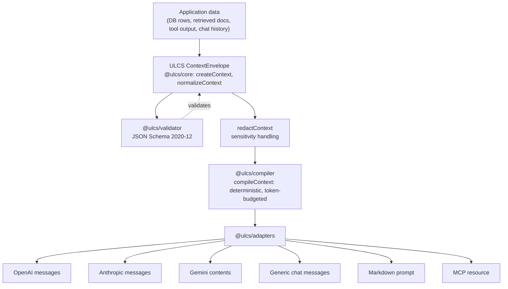

# Universal LLM Context Schema (ULCS)

> **Status: Draft (`0.1.0`, spec `1.0.0-draft`).** This is an early-stage,
> vendor-neutral proposal — not an established industry standard. See
> [Stability status](#stability-status) before depending on it in
> production.

ULCS is an open, vendor-neutral standard for representing the context you
give to a Large Language Model — facts, instructions, conversation history,
retrieved documents, tool output, memory, preferences — as structured,
validated, provenance-tracked data, independent of any single model
provider's message format.

```bash
npm i -g @ulcs/cli   # (workspace-local for now — see Quick start)
ulcs validate my-context.json
ulcs compile my-context.json --target openai
```

## The problem

Every LLM application eventually builds the same untyped pile: a system
prompt string, some retrieved text, a JSON blob of "facts," a conversation
array, maybe a memory store — all flattened into one string or one
provider's message array right before the API call. That flattening throws
away information that matters:

- **Facts and instructions become indistinguishable.** A retrieved web page
  and a developer's system prompt end up as adjacent, equally-weighted text.
- **Trust is implicit, if tracked at all.** Nothing stops a scraped page's
  content from reading like an authoritative instruction.
- **Sensitivity labels don't survive the trip** from database to prompt.
- **Token-budget truncation is ad hoc and non-deterministic**, so the same
  input can produce a different compiled prompt on every run.
- **Every provider integration reinvents this pipeline from scratch**, with
  no shared vocabulary between an OpenAI integration, an Anthropic
  integration, and a RAG pipeline in the same codebase.

ULCS is a schema, a vocabulary, and a small deterministic toolchain for the
step _before_ any of that flattening happens.

## Why this is not just another prompt template

A prompt template fills placeholders in a string. ULCS is a **data model**:
it defines what a fact _is_, what an instruction's authority _is_, what
"untrusted" _means_, and how to compile a validated document under a token
budget into six different provider shapes — deterministically, with every
lossy decision documented. You can build a prompt template on top of a
compiled ULCS context; you cannot recover ULCS's structure (trust,
authority, provenance, sensitivity, token accounting) from a template.

Concretely, ULCS gives you things a template cannot:

- A JSON Schema you can validate against in CI.
- A hard guarantee that untrusted content can never become an authoritative
  instruction (schema-enforced, not just documented).
- A merge algorithm that never silently overwrites a disputed fact.
- A deterministic compiler with a documented, testable token-budget
  algorithm — not "whatever `.slice()` calls happened to survive review."

## How ULCS differs from adjacent standards

|                                                                | What it does                                                                                  | Relationship to ULCS                                                                                                                                                                    |
| -------------------------------------------------------------- | --------------------------------------------------------------------------------------------- | --------------------------------------------------------------------------------------------------------------------------------------------------------------------------------------- |
| **Schema.org**                                                 | Shared vocabulary for web entities (Person, Product...), for search engines.                  | Same "shared vocabulary via JSON-LD" pattern, applied to LLM context instead of web pages. No concept of instruction authority or trust.                                                |
| **JSON Schema (2020-12)**                                      | Validates JSON structure.                                                                     | ULCS _uses_ it — `schemas/v1/*.schema.json` are the normative validation layer. It doesn't define what a "fact" means; ULCS's vocabulary docs do.                                       |
| **JSON-LD**                                                    | Gives JSON documents linkable semantics via `@context`/`@type`.                               | ULCS's canonical form (`schemas/context/v1.jsonld`); plain JSON without JSON-LD processing is equally valid ULCS.                                                                       |
| **MCP (Model Context Protocol)**                               | Transports context, resources, and tool calls between an AI application and external systems. | ULCS defines _what the content means_; MCP defines _how it moves_. A `ContextEnvelope` can be the `text` of an MCP resource. They compose — see `specification/v1/interoperability.md`. |
| **RAG frameworks**                                             | Retrieval pipelines that fetch and rank documents.                                            | ULCS gives a retriever's output a standard shape (`Resource`/`Fact` + `Citation` + `trust.level: "untrusted"`) so different retrievers interoperate.                                    |
| **Provider message APIs** (OpenAI/Anthropic/Gemini `messages`) | The wire format one specific API accepts.                                                     | ULCS compiles _into_ these — see `@ulcs/adapters` — and depends on none of their SDKs.                                                                                                  |

## Quick start (5 minutes)

```bash
git clone <this-repo> ulcs && cd ulcs
pnpm install
pnpm run build

# Validate a document against the schema
node packages/cli/dist/bin.js validate examples/minimal/context.json

# Compile it under its token policy and render it for OpenAI
node packages/cli/dist/bin.js compile examples/minimal/context.json --target openai
```

Or use the SDK directly:

```typescript
import { createContext, normalizeContext } from "@ulcs/core";
import { validateContext } from "@ulcs/validator";
import { compileContext } from "@ulcs/compiler";
import { toOpenAIMessages } from "@ulcs/adapters";

const ctx = createContext({
  instructions: [
    {
      id: "urn:ulcs:instr:1",
      "@type": "Instruction",
      authority: "system",
      content: "Answer using only the facts provided.",
      trust: { level: "trusted", providesInstructions: true },
    },
  ],
  facts: [{ id: "urn:ulcs:fact:1", "@type": "Fact", content: "The customer is on the Pro plan." }],
});

const normalized = normalizeContext(ctx);
validateContext(normalized); // { valid: true, errors: [] }

const compiled = compileContext(normalized);
const { messages } = toOpenAIMessages(compiled);
// pass `messages` into the official `openai` SDK yourself
```

## Minimal example

```json
{
  "@context": "https://ulcs.dev/context/v1",
  "@type": "ContextEnvelope",
  "schemaVersion": "1.0.0",
  "id": "urn:ulcs:context:minimal-qa",
  "createdAt": "2026-08-15T12:00:00Z",
  "instructions": [
    {
      "id": "urn:ulcs:instr:system-1",
      "@type": "Instruction",
      "authority": "system",
      "content": "Answer only using the facts provided in this context.",
      "trust": { "level": "trusted", "providesInstructions": true }
    }
  ],
  "facts": [
    {
      "id": "urn:ulcs:fact:1",
      "@type": "Fact",
      "content": "ULCS is a draft context standard for LLMs."
    }
  ]
}
```

See [`examples/`](./examples) for ten more, covering RAG with a live
prompt-injection sample, agent tool results, long-term memory, conflicting
facts, expired information, sensitivity-based redaction, token-budget
compilation, and every provider adapter's output side by side.

## Architecture

```text
Application data
      ↓
ULCS semantic context        (ContextEnvelope + ContextItems — @ulcs/core)
      ↓
Validation, security policy  (@ulcs/validator, redactContext)
and token compilation        (@ulcs/compiler)
      ↓
Provider adapter             (@ulcs/adapters)
      ↓
OpenAI / Claude / Gemini / local model / MCP host
```



Monorepo layout:

```text
ulcs/
├── specification/v1/     Draft spec, vocabulary, precedence, provenance, security, token-policy, interoperability
├── specification/decisions/  Architecture Decision Records
├── schemas/v1/            JSON Schema 2020-12 (envelope, item, patch, definitions)
├── schemas/context/       JSON-LD context
├── packages/core/         Types + createContext/normalizeContext/mergeContexts/applyContextPatch/deduplicateContext/filterContext/rankContext/redactContext/exportContext/compareContexts
├── packages/validator/    Ajv 2020-12 validation, JSON-Pointer error paths
├── packages/compiler/     Deterministic token-budget compiler
├── packages/adapters/     OpenAI/Anthropic/Gemini/generic/Markdown/MCP renderers
├── packages/cli/          `ulcs` binary
├── examples/               11 runnable example documents
├── tests/conformance/      Schema + spec-guarantee conformance tests
├── tests/interoperability/ Cross-adapter and MCP/JSON-LD checks
├── tests/fixtures/         Positive/negative schema fixtures
└── benchmark/               Honest, non-accuracy evaluation harness
```

## Stability status

| Area                                | Status                                                                                   |
| ----------------------------------- | ---------------------------------------------------------------------------------------- |
| Specification (`specification/v1/`) | **Draft.** Field names and semantics may change; breaking changes are recorded as ADRs.  |
| JSON Schemas (`schemas/v1/`)        | **Draft**, matches the spec. `strict: false` is used in Ajv deliberately — see ADR-0003. |
| `@ulcs/core`                        | Functional, unit-tested, deterministic. Pre-1.0 — API may still shift.                   |
| `@ulcs/validator`                   | Functional. Reads schemas from the repo directly (see "Known limitations").              |
| `@ulcs/compiler`                    | Functional, deterministic, unit-tested.                                                  |
| `@ulcs/adapters`                    | Functional for the six documented targets; no live provider SDK calls.                   |
| `@ulcs/cli`                         | Functional; all six commands exercised by tests.                                         |
| Experimental provenance signing     | Explicitly out of the stable API — see `specification/v1/provenance.md#5`.               |

## Versioning policy

Semantic Versioning 2.0.0. While the monorepo is at `0.x`, breaking changes
may land in any `0.x` minor release (documented in `CHANGELOG.md`, and via
an ADR for schema-shape changes). After `1.0.0`, breaking changes to the
schemas or documented SDK surface require a major bump. `schemaVersion`
inside documents follows the same policy independently of package
versions.

## Roadmap

- [ ] Community review of the v1 vocabulary and precedence model.
- [ ] Package-name availability check before any real `npm publish`
      (current names are placeholders — see "Known limitations").
- [ ] Bundle schemas into `@ulcs/validator` so it's standalone-publishable.
- [ ] Real tokenizer adapters (tiktoken, SentencePiece) as optional peer
      packages.
- [ ] A conformance badge/checker other implementations (non-TypeScript)
      can run against.
- [ ] Community governance transition — see `GOVERNANCE.md`.

## Limitations

- The reference tokenizer is a documented approximation
  (`~4 chars/token`), not an accurate count for any specific model.
- `@ulcs/validator` currently reads schema files from the repository's
  `schemas/` directory via a relative path rather than bundling them —
  fine within this monorepo, not yet fine for a standalone npm install.
  See ADR-0003.
- Package names (`@ulcs/*`) are placeholders; availability on the public
  npm registry has not been verified. Confirm before publishing.
- `compileContext` does not perform full sensitivity redaction — call
  `redactContext` first for any context that may contain
  `restricted`/`personal`/`secret` items (see `specification/v1/security.md`).
- ULCS labels security policy; it does not enforce it beyond what
  `redactContext` performs on data explicitly passed to it. See
  `specification/v1/security.md`.
- Provider adapters are hand-verified against each provider's _documented_
  message shape, not against live API calls (no network access is used or
  required by the test suite).

## Contributing

See [CONTRIBUTING.md](./CONTRIBUTING.md) for the development workflow,
commit conventions, and how to propose spec changes via an ADR.
[CODE_OF_CONDUCT.md](./CODE_OF_CONDUCT.md) applies to all project spaces.
Security issues: see [SECURITY.md](./SECURITY.md) — please do not open a
public issue for a vulnerability. Project governance (pre-1.0, moving
toward a community model): see [GOVERNANCE.md](./GOVERNANCE.md).

## License

[Apache-2.0](./LICENSE) — see `specification/decisions/0002-license-choice.md`
for the rationale.
